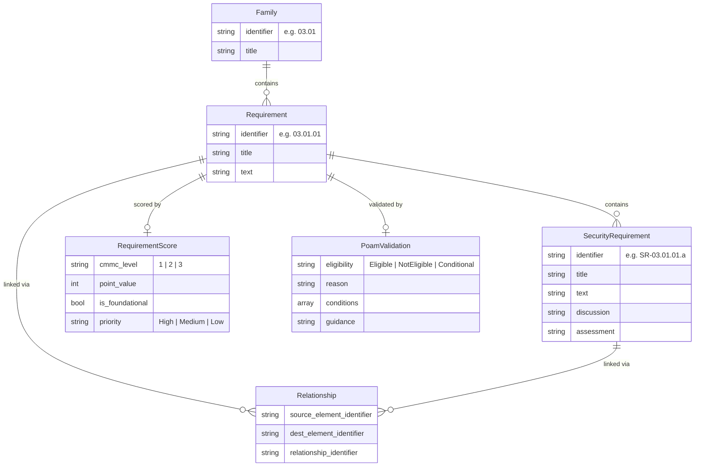

# NIST Document API

REST API for querying **NIST SP 800-53**, **SP 800-171**, **SP 800-172**, and **FAR 52.204-21** security requirements, built for CMMC compliance workflows.

The official [NIST CPRT](https://csrc.nist.gov/projects/cprt/catalog#/cprt/home) JSON exports are the authoritative source for this data. However, consuming them directly means wrestling with very complex nested structures and stitching together multiple documents by hand, and applying CMMC scoring and POA&M rules from separate guidance yourself. 
The point of this API, then, was to serve the user that same information through a clean, fast, (and tokio) REST interface, so that the information could be used for compliance dashboards, audit automation, and LLM pipelines (`text/toon` content header) doing CMMC gap analysis.

Documents are loaded from the official NIST CPRT JSON exports at startup, indexed in memory, and served as a clean read-only JSON API. No database required.

A Swagger UI is available at [`http://localhost:3000/`](http://localhost:3000/) and the raw OpenAPI spec at [`/api-docs/openapi.json`](http://localhost:3000/api-docs/openapi.json) — both generated at compile time by [utoipa](#api-documentation-openapi--utoipa). The same catalog is also exposed as [MCP tools](#mcp-server) at `POST /mcp` for AI assistants.

---

## Running

> [!TIP]
> When in the source directory, running `make help` will give you a list of all Makefile functions.

The API listens on port 3000 by default, this can be changed by editing the constant `DEFAULT_PORT` in [main.rs](https://github.com/IronShield-Tech/tolerance-api/blob/main/src/main.rs).

### Environment Variables, See [main](https://github.com/IronShield-Tech/tolerance-api/blob/main/src/main.rs).

| Variable                  | Default  | Description                       |
|---------------------------|----------|-----------------------------------|
| `HOST`                    | `::`     | Bind address                      |
| `PORT`                    | `3000`   | Bind port                         |
| `RUST_LOG`                | `tolerance_api=info,tower_http=debug` | Log filter |
| `NIST_SP800_53_R5_PATH`   | `data/cprt_SP_800_53_5_2_0_03-10-2026.json`  | Override data file path |
| `NIST_SP800_53A_R5_PATH`  | `data/cprt_SP_800_53_A_5_2_0_03-10-2026.json` | Override data file path |
| `NIST_SP800_53B_R5_PATH`  | `data/cprt_SP_800_53_B_5_2_0_03-10-2026.json` | Override data file path |
| `NIST_SP800_171_R3_PATH`  | `data/cprt-sp_800_171_3_0_0-...json` | Override data file path |
| `NIST_SP800_171_R2_PATH`  | `data/cprt-sp_800_171_2_0_0.json`    | Override data file path |
| `NIST_SP800_171_R1_PATH`  | `data/cprt-sp_800_171_1_0_0.json`    | Override data file path |
| `NIST_SP800_172_V1_PATH`  | `data/cprt-sp_800_172_1_0_0.json`    | Override data file path |
| `NIST_SP800_171A_V1_PATH` | `data/cprt-sp_800_171a_1_0_0.json`   | Override data file path |
| `NIST_SP800_171A_R3_PATH` | `data/cprt-sp_800_171_a_3_0_0.json`  | Override data file path |
| `NIST_SP800_172A_V1_PATH` | `data/cprt-sp_800_172a_1_0_0.json`   | Override data file path |
| `FAR_52_204_21_PATH`      | `data/cprt-far_52_204_21-...json`    | Override data file path |

---

## URL Structure

All endpoints are versioned and take a `document` + `revision` path segment:

```
/v1/nist/:document/:revision/...
/v1/far/:document/:revision/...
```

### Valid Document / Revision Combinations

| Document       | Revision | Path Example                         |
|----------------|----------|--------------------------------------|
| `sp800-53`     | `r5`     | `/v1/nist/sp800-53/r5/...`           |
| `sp800-53a`    | `r5`     | `/v1/nist/sp800-53a/r5/...`          |
| `sp800-53b`    | `r5`     | `/v1/nist/sp800-53b/r5/...`          |
| `sp800-171`    | `r1`     | `/v1/nist/sp800-171/r1/...`          |
| `sp800-171`    | `r2`     | `/v1/nist/sp800-171/r2/...`          |
| `sp800-171`    | `r3`     | `/v1/nist/sp800-171/r3/...`          |
| `sp800-171a`   | `v1`     | `/v1/nist/sp800-171a/v1/...`         |
| `sp800-171a`   | `r3`     | `/v1/nist/sp800-171a/r3/...`         |
| `sp800-172`    | `v1`     | `/v1/nist/sp800-172/v1/...`          |
| `sp800-172a`   | `v1`     | `/v1/nist/sp800-172a/v1/...`         |
| `52.204-21`    | `v2`     | `/v1/far/52.204-21/v2/...`           |

---

## Response Format

All endpoints return `application/json` by default.

Send `Accept: text/toon` to receive a token-efficient plain-text format (30–40% fewer tokens, useful for LLM pipelines):

```bash
curl -H "Accept: text/toon" http://localhost:3000/v1/nist/sp800-171/r3/summary
```

Errors always return JSON, and errors use typical HTTP failure codes. See [the HTTP response reference](https://developer.mozilla.org/en-US/docs/Web/HTTP/Reference/Status).

---

## API Documentation (OpenAPI / utoipa)

The OpenAPI 3 specification is generated **at compile time** with
[`utoipa`](https://docs.rs/utoipa): every REST handler carries a `#[utoipa::path(...)]`
annotation (method, path, params, request/response bodies, tag), every DTO derives
`utoipa::ToSchema`, and the `ApiDoc` struct in `src/doc/openapi.rs` assembles them into the
spec. Because the docs are derived from the same code that serves the routes, they cannot
drift from the implementation.

| Where | What |
|-------|------|
| [`GET /`](http://localhost:3000/) | Interactive Swagger UI (custom-branded, served from `src/doc/swagger.rs`) |
| [`GET /api-docs/openapi.json`](http://localhost:3000/api-docs/openapi.json) | Raw OpenAPI 3 spec (cached 5 min) |

Endpoints are grouped under four tags: **Health**, **NIST**, **POA&M**, and **FAR**. The
spec's `info` description also documents the supported document/revision matrix, the
171A/172A assessment-guide element types (`determination`, `examine`, `interview`, `test`,
ODP types), and `text/toon` content negotiation — so the Swagger UI is self-contained for
new consumers.

**Adding an endpoint to the docs:** annotate the handler with `#[utoipa::path(...)]`,
derive `ToSchema` on any new request/response types, then register both in `ApiDoc`
(`paths(...)` and `components(schemas(...))`) in `src/doc/openapi.rs`.

> [!NOTE]
> The MCP endpoint (`POST /mcp`, below) is intentionally *not* in the OpenAPI spec — it is
> a JSON-RPC surface, and MCP clients discover its capabilities through the protocol itself
> (`tools/list` / `server/discover`), not through OpenAPI.

---

## MCP Server

The same catalog is exposed as an **MCP (Model Context Protocol)** tool surface at
`POST /mcp`, so AI assistants (Cursor, Claude, etc.) can query NIST/FAR text and CMMC
POA&M rules as native tools. It runs **in-process** over the same in-memory indexes as the
REST API — no separate service, no HTTP self-calls, read-only public standards data only.

### Tools

| Tool | Arguments | Returns |
|------|-----------|---------|
| `list_documents` | — | Every loaded document/revision pair with display names. Call first to discover valid arguments. |
| `get_summary` | `document`, `revision` | Document metadata + element counts by type. |
| `search_elements` | `document`, `revision`, `query`, `type?`, `limit?` | Full-text search over identifiers, titles, and text (inverted index; default 20, max 200 results). |
| `get_element` | `document`, `revision`, `identifier` | One element by exact ID, with relationship-linked statement / discussion / examine / interview / test text resolved so a single call returns the full official text. |
| `get_element_relationships` | `document`, `revision`, `identifier` | Every relationship edge the element participates in (e.g. 171 ↔ 171A objective mapping). |
| `validate_poam` | `document`, `revision`, `requirement_ids[]` | CMMC POA&M eligibility per requirement, with scoring rationale and counts. |
| `get_non_eligible_requirements` | `document`, `revision` | Requirements that can never be deferred to a POA&M. |

Tool results are **TOON-encoded text** (the same LLM-optimized format as `Accept: text/toon`),
keeping token usage low for the consuming model. Unknown tools and bad arguments come back
as `isError` tool results per spec, not protocol errors.

### Protocol support

Both protocol eras are supported (the server is stateless by construction, so this is cheap):

- **Legacy handshake** (`2024-11-05` … `2025-11-25`, today's Cursor/Claude): `initialize`
  is answered with a negotiated version; nothing session-like is required afterwards.
- **Stateless 2026-07-28**: `server/discover` for capability discovery, per-request `_meta`,
  and SEP-2243 `Mcp-Method` / `Mcp-Name` / `MCP-Protocol-Version` header–body validation —
  a mismatch is rejected with `400` and a JSON-RPC error. Headers are validated when present
  but not required, so legacy clients keep working.

Notifications (requests without an `id`) return `202 Accepted` with no body. Responses are
always JSON objects — no SSE, since every tool answers immediately from memory.

```bash
# List the available tools
curl -s http://localhost:3000/mcp -H 'Content-Type: application/json' \
  -d '{"jsonrpc":"2.0","id":1,"method":"tools/list"}'

# Call a tool
curl -s http://localhost:3000/mcp -H 'Content-Type: application/json' \
  -d '{"jsonrpc":"2.0","id":2,"method":"tools/call","params":{"name":"get_element","arguments":{"document":"sp800-171","revision":"r3","identifier":"03.05.03"}}}'
```

Cursor config (`.cursor/mcp.json`):

```json
{
  "mcpServers": {
    "tolerance-api": { "url": "https://<host>/mcp" }
  }
}
```

### Module layout & extending

The MCP code is deliberately modular (`src/mcp/`):

```
src/mcp/
├── mod.rs            module map + wiring
├── constants.rs      every version, header name, limit, description string
├── handler.rs        axum entry point: parse → validate → dispatch
├── headers.rs        SEP-2243 header/body validation
├── discovery.rs      initialize + server/discover responses
├── protocol/         wire types (JSON-RPC envelope, tool shapes)
├── tools/            the registry — one file per tool, shared helpers in support.rs
└── tests/            fixtures + tool and protocol tests, mirroring the source layout
```

**Adding a tool:** create one file in `src/mcp/tools/` exposing `definition()` and
`call(state, args)`, then add one line to the `REGISTRY` table in `src/mcp/tools/mod.rs`.
`tools/list` and dispatch both derive from the registry, so they can never drift apart
(a test asserts every registry name matches its definition).

---

## Data Model



---

### NIST — Available Documents

- **`GET` `/v1/nist/documents`**

Returns all loaded NIST documents.

```bash
curl http://localhost:3000/v1/nist/documents
```

```json
[
  { "id": "sp800-53/r5",  "name": "SP 800-53 Rev 5",  "document": "sp800-53",  "revision": "r5" },
  { "id": "sp800-53a/r5", "name": "SP 800-53A Rev 5", "document": "sp800-53a", "revision": "r5" },
  { "id": "sp800-53b/r5", "name": "SP 800-53B Rev 5", "document": "sp800-53b", "revision": "r5" },
  { "id": "sp800-171/r3", "name": "SP 800-171 Rev 3", "document": "sp800-171", "revision": "r3" },
  { "id": "sp800-171/r2", "name": "SP 800-171 Rev 2", "document": "sp800-171", "revision": "r2" }
]
```

---

### NIST — Summary

- **`GET` `/v1/nist/:document/:revision/summary`**

```bash
curl http://localhost:3000/v1/nist/sp800-171/r3/summary
```

```json
{
  "document": {
    "doc_identifier": "SP_800_171_3_0_0",
    "name": "SP 800-171",
    "version": "3.0.0",
    "website": "https://csrc.nist.gov/projects/cprt"
  },
  "family_count": 17,
  "requirement_count": 82,
  "security_requirement_count": 176,
  "relationship_count": 512
}
```

---

### NIST — Families

- **`GET` `/v1/nist/:document/:revision/families`**
- **`GET` `/v1/nist/:document/:revision/families/:id`**

Families are the top-level groupings (e.g. `03.01 Access Control`). Each family response includes nested requirements and security requirements.

- All families
```
curl http://localhost:3000/v1/nist/sp800-171/r3/families
```

- Single family
```
curl http://localhost:3000/v1/nist/sp800-171/r3/families/03.01
```

```json
{
  "identifier": "03.01",
  "title": "Access Control",
  "requirements": [
    {
      "identifier": "03.01.01",
      "title": "Account Management",
      "text": "...",
      "security_requirements": [
        {
          "identifier": "SR-03.01.01.a",
          "title": "...",
          "text": "...",
          "discussion": "...",
          "assessment": "..."
        }
      ],
      "score": { "cmmc_level": "1", "point_value": 3, "is_foundational": true, "priority": "High" },
      "poam_validation": { "requirement_id": "03.01.01", "eligibility": "NotEligible", ... }
    }
  ]
}
```

---

### NIST — Requirements

- **`GET` `/v1/nist/:document/:revision/requirements`**

All requirements across all families. Each requirement includes its nested security requirements, CMMC score, and POA&M validation.

```bash
curl http://localhost:3000/v1/nist/sp800-171/r3/requirements
```

---

### NIST — Security Requirements

- **`GET` `/v1/nist/:document/:revision/security-requirements`**

All security requirements with their `discussion` and `assessment` text.

```bash
curl http://localhost:3000/v1/nist/sp800-171/r3/security-requirements
```

---

### NIST — Elements

- **`GET` `/v1/nist/:document/:revision/elements`**
- **`GET` `/v1/nist/:document/:revision/elements/:id`**

Raw elements with **search**, **type filtering**, and **pagination**.

| Query Param | Type     | Default | Description |
|-------------|----------|---------|-------------|
| `type`      | `string` | —       | **800-171/172:** `family`, `requirement`, `security_requirement`, `discussion`, `assessment`, `adversary_effect`, `protection_strategy`, `effect`, `tactic`, `impact`, `expected_result`, `example` — **800-53:** `control`, `control_enhancement`, `control_statement`, `security_baseline`, `privacy_baseline`, `reference`, `public_comment` |
| `search`    | `string` | —       | Full-text search in title and text |
| `limit`     | `int`    | `100`   | Max results (hard cap: `1000`) |
| `offset`    | `int`    | `0`     | Pagination offset |


- All elements (first 100)
```bash
curl http://localhost:3000/v1/nist/sp800-171/r3/elements
```

- Only families
```bash
curl "http://localhost:3000/v1/nist/sp800-171/r3/elements?type=family"
```

- Search for "encryption"
```bash
curl "http://localhost:3000/v1/nist/sp800-171/r3/elements?search=encryption"
```

- Security requirements matching "access", page 2
```bash
curl "http://localhost:3000/v1/nist/sp800-171/r3/elements?type=security_requirement&search=access&limit=50&offset=50"
```

- Single element by ID
```bash
curl http://localhost:3000/v1/nist/sp800-171/r3/elements/03.01.01
```

```json
{
  "data": [
    {
      "element_type": "requirement",
      "element_identifier": "03.01.01",
      "title": "Account Management",
      "text": "...",
      "doc_identifier": "SP_800_171_3_0_0"
    }
  ],
  "total": 82,
  "limit": 100,
  "offset": 0,
  "has_more": false
}
```

---

### NIST — Relationships

- **`GET` `/v1/nist/:document/:revision/relationships`**
- **`GET` `/v1/nist/:document/:revision/elements/:id/relationships`**


- All relationships
```bash
curl http://localhost:3000/v1/nist/sp800-171/r3/relationships
```

- Relationships for a specific element (source or destination)
```bash
curl http://localhost:3000/v1/nist/sp800-171/r3/elements/03.01.01/relationships
```

```json
[
  {
    "source_element_identifier": "03.01.01",
    "source_doc_identifier": "SP_800_171_3_0_0",
    "dest_element_identifier": "03.01",
    "dest_doc_identifier": "SP_800_171_3_0_0",
    "relationship_identifier": "belongs_to",
    "provenance_doc_identifier": "SP_800_171_3_0_0"
  }
]
```

---

### POA&M Validation

Validates whether NIST requirements can be placed on a Plan of Action & Milestones.

**Rules:**
- **Level 1 foundational** → `NotEligible` (must implement immediately)
- **Level 1 non-foundational** → `Conditional` (exec approval + 90 days)
- **Level 2 high-priority** → `Conditional` (compensating controls + 180 days)
- **Level 2 medium/low** → `Eligible` (remediation plan + 365 days)
- **Level 3** → `Eligible` (risk acceptance + 365 days)

#### Validate a single requirement

- **`GET` `/v1/nist/:document/:revision/poam/validate/:requirement_id`**

```bash
curl http://localhost:3000/v1/nist/sp800-171/r3/poam/validate/03.01.01
```

```json
{
  "requirement_id": "03.01.01",
  "eligibility": "NotEligible",
  "reason": "FoundationalRequirement",
  "conditions": [],
  "guidance": "This is a foundational CMMC Level 1 requirement and must be implemented immediately..."
}
```

#### Validate a batch

- **`POST` `/v1/nist/:document/:revision/poam/validate`**
> With `Content-Type: application/json`

```bash
curl -X POST http://localhost:3000/v1/nist/sp800-171/r3/poam/validate \
  -H "Content-Type: application/json" \
  -d '{"requirement_ids": ["03.01.01", "03.01.03", "03.02.01"]}'
```

```json
{
  "validations": [ ... ],
  "total": 3,
  "eligible_count": 1,
  "not_eligible_count": 1,
  "conditional_count": 1
}
```

#### Non-eligible requirements

- **`GET` `/v1/nist/:document/:revision/poam/non-eligible`**

```bash
curl http://localhost:3000/v1/nist/sp800-171/r3/poam/non-eligible
```

Returns a list of requirement IDs that cannot be added to a POA&M.

---

### SP 800-53

SP 800-53 Rev 5 endpoints work exactly like the other NIST endpoints. Three documents are supported: the main controls catalog (`sp800-53`), the assessment procedures (`sp800-53a`), and the control baselines (`sp800-53b`).

- Summary
```bash
curl http://localhost:3000/v1/nist/sp800-53/r5/summary
```

- All families
```bash
curl http://localhost:3000/v1/nist/sp800-53/r5/families
```

- Single family
```bash
curl http://localhost:3000/v1/nist/sp800-53/r5/families/AC
```

- All requirements
```bash
curl http://localhost:3000/v1/nist/sp800-53/r5/requirements
```

- Elements with search
```bash
curl "http://localhost:3000/v1/nist/sp800-53/r5/elements?search=encryption"
```

- SP 800-53A (assessment procedures)
```bash
curl http://localhost:3000/v1/nist/sp800-53a/r5/summary
```

- SP 800-53B (control baselines)
```bash
curl http://localhost:3000/v1/nist/sp800-53b/r5/summary
```

---

### FAR 52.204-21

The FAR endpoints mirror the NIST endpoints. The only supported document is `52.204-21` at revision `v2`.

- Summary
```bash
curl http://localhost:3000/v1/far/52.204-21/v2/summary
```

- All families
```
curl http://localhost:3000/v1/far/52.204-21/v2/families
```

- Single family
```bash
curl http://localhost:3000/v1/far/52.204-21/v2/families/AC
```

- All requirements
```bash
curl http://localhost:3000/v1/far/52.204-21/v2/requirements
```

- Elements with search
```bash
curl "http://localhost:3000/v1/far/52.204-21/v2/elements?search=access"
```

- Single element
```
curl http://localhost:3000/v1/far/52.204-21/v2/elements/AC.1
```

- All relationships
```bash
curl http://localhost:3000/v1/far/52.204-21/v2/relationships
```

- Element relationships
```bash
curl http://localhost:3000/v1/far/52.204-21/v2/elements/AC.1/relationships
```

---

## Rust Examples

Using [`reqwest`](https://docs.rs/reqwest) with [`serde_json`](https://docs.rs/serde_json):

```rust
use reqwest::Client;
use serde_json::Value;

#[tokio::main]
async fn main() -> Result<(), Box<dyn std::error::Error>> {
    let client = Client::new();
    let base = "http://localhost:3000";

    // Get summary
    let summary: Value = client
        .get(format!("{}/v1/nist/sp800-171/r3/summary", base))
        .send().await?
        .json().await?;
    println!("{}", summary["family_count"]);

    // Get all families
    let families: Value = client
        .get(format!("{}/v1/nist/sp800-171/r3/families", base))
        .send().await?
        .json().await?;

    // Search elements
    let results: Value = client
        .get(format!("{}/v1/nist/sp800-171/r3/elements", base))
        .query(&[("search", "encryption"), ("type", "requirement")])
        .send().await?
        .json().await?;
    println!("Found {} results", results["total"]);

    // Validate a single requirement for POA&M
    let validation: Value = client
        .get(format!("{}/v1/nist/sp800-171/r3/poam/validate/03.01.01", base))
        .send().await?
        .json().await?;
    println!("Eligibility: {}", validation["eligibility"]);

    // Batch POA&M validation
    let batch: Value = client
        .post(format!("{}/v1/nist/sp800-171/r3/poam/validate", base))
        .json(&serde_json::json!({
            "requirement_ids": ["03.01.01", "03.01.03", "03.02.01"]
        }))
        .send().await?
        .json().await?;
    println!("{} eligible", batch["eligible_count"]);

    // LLM-optimized output (text/toon format)
    let toon = client
        .get(format!("{}/v1/nist/sp800-171/r3/requirements", base))
        .header("Accept", "text/toon")
        .send().await?
        .text().await?;

    Ok(())
}
```

---

### Identifier Format

| Type                 | Example           |
|----------------------|-------------------|
| Family               | `03.01`           |
| Requirement          | `03.01.01`        |
| Security Requirement | `SR-03.01.01.a`   |
